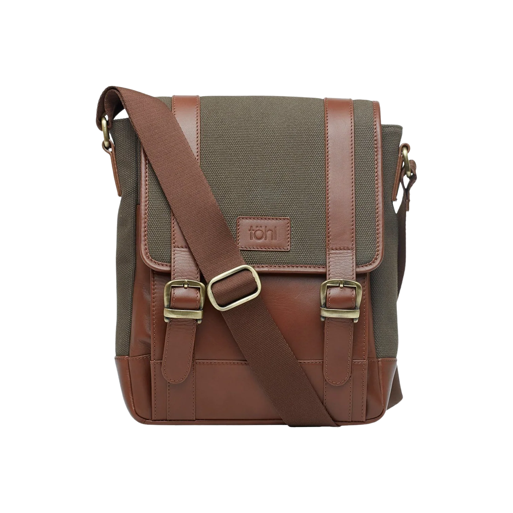
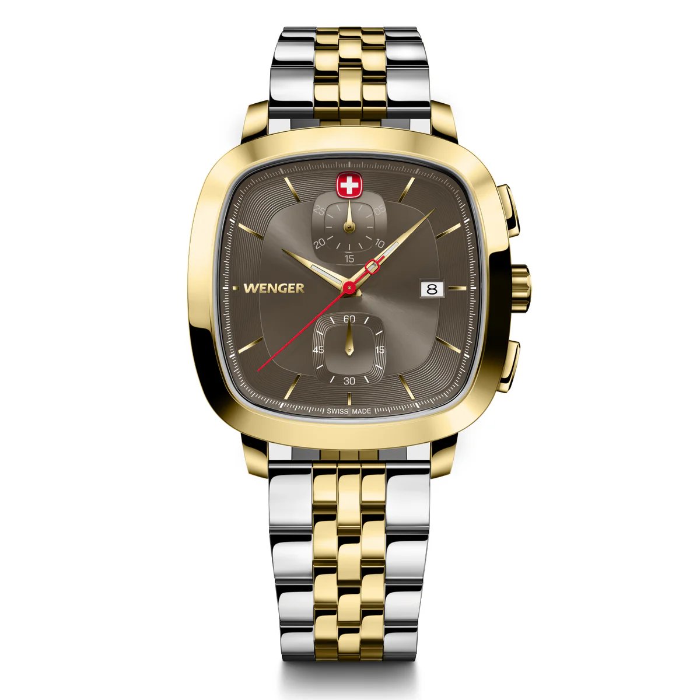
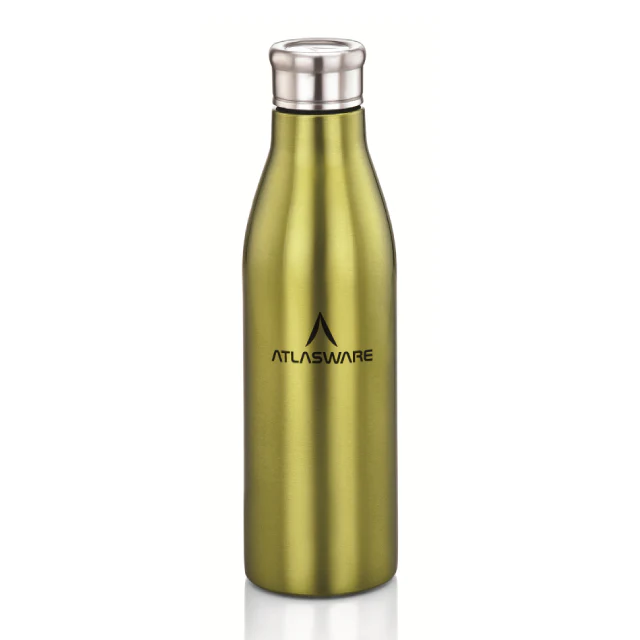

# Product_card
## Date:09-07-2025
## Objective:

To replicate a product card layout similar to those found on real-time e-commerce platform like FlipKart using the CSS Box Model (margin, border, padding, and content).

## Tasks:

#### 1. Structure the HTML Layout:
Create a container ```<div>``` for the product card.

Add an `````` for the product image.

Include ```<h2>``` for product name, ```<p>``` for description, and a ```<span>``` or ```<div>``` for price.

Add a “Buy Now” or “Add to Cart” button.

#### 2. Apply Box Model Styling in CSS:
Use padding inside each section (image, text, button) to ensure readability.

Use margin around the card to space it from the page edges or other cards.

Add a border to outline the card.

Control width and height for consistent sizing.

#### 3. Visual Styling:
Add a background color to the card container.

Use box-shadow to simulate depth (card lifting effect).

Add border-radius for rounded corners.

#### 4. Center the Card:
Use display: flex and justify-content: center and align-items: center on the parent container.

#### 5. Bonus Enhancements:
Use a hover effect on the button (e.g., background color change).

Make the card responsive with percentage-based widths or media queries.
## HTML Code:
```
<!DOCTYPE html>
<html lang="en">
<head>
    <title>Product Card</title>
    <link rel="stylesheet" href="style.css">
</head>
<body>
    <h1>Flipkart - Product Card</h1>
    <div class="box-model">
        <div class="container">
            
            <h2>Canvas Sling Bag</h2>
            <p>Stylish and compact sling bag perfect for casual outings. Made with durable canvas and zip closure.</p>
            <span class="price">$18.99</span>
            <br>
            <button>Add to Cart</button>
        </div>
        <div class="container">
            
            <h2>Classic Wrist Watch</h2>
            <p>Elegant analog wrist watch with leather strap. Suitable for both casual and formal wear.</p>
            <span class="price">$35.00</span>
            <br>
            <button>Add to Cart</button>
        </div>
        <div class="container">
            
            <h2>Insulated Bottle</h2>
            <p>Double-wall stainless steel bottle keeps drinks cold for 24 hrs or hot for 12 hrs. Leak-proof design.</p>
            <span class="price">$12.50</span>
            <br>
            <button>Add to Cart</button>
        </div>
    </div>
</body>
</html>

```
## CSS Code:
```
body {
  background-color: #eef1f4;
  font-family: 'Segoe UI', sans-serif;
  margin: 0;
  padding: 0;
}

h1 {
  text-align: center;
  margin: 30px 0;
  color: #333;
}
.box-model {
  display: flex;
  flex-wrap: wrap;
  justify-content: center;
  gap: 30px;
  padding: 20px;
}
.container {
  background-color: #ffffff;
  border: 1px solid #ddd;
  border-radius: 16px;
  box-shadow: 0 8px 24px rgba(0, 0, 0, 0.08);
  width: 260px;
  padding: 20px;
  text-align: center;
  transition: transform 0.3s, box-shadow 0.3s;
}

.container:hover {
  transform: translateY(-5px);
  box-shadow: 0 12px 30px rgba(0, 0, 0, 0.15);
}
.container img {
  width: 100%;
  height: 180px;
  object-fit: cover;
  border-radius: 12px;
  margin-bottom: 15px;
}
h2 {
  font-size: 18px;
  margin: 10px 0 8px;
  color: #222;
}

p {
  font-size: 14px;
  color: #666;
  margin-bottom: 12px;
}

.price {
  display: block;
  font-size: 16px;
  color: #007b5e;
  font-weight: bold;
  margin-bottom: 15px;
}
button {
  background-color: #007b5e;
  color: white;
  border: none;
  border-radius: 8px;
  padding: 10px 16px;
  font-size: 14px;
  cursor: pointer;
  transition: background-color 0.3s;
}

button:hover {
  background-color: #005f49;
}

```
## Output:


## Result:
A product card layout similar to those found on real-time e-commerce platform like FlipKart using the CSS Box Model is replicated successfully.
